# Ghroths Asche - Campaign Flow Visualization

This diagram outlines the planned structure and flow of the campaign, inspired by Tales from the Loop's mystery connections and incorporating the Uhrensystem.

```mermaid
graph TD
    subgraph Campaign Flow: Ghroths Asche

        %% Phase 1: Linear Introduction (The What)
        subgraph Phase 1: Introduction [Linear Intro - Discovering the Asche]
            P1_Start((Start)) --> M1["[[01 - Der Asche-Zorn von Black Creek]]"];
            M1 --> M2["[[02 - Das Gewicht, das verweilt]]"];
            M2 --> M3["[[03 - Der Schattengefaltete Chor]]"];
            M3 --> P1_End((Activate Clocks));
        end

        %% Phase 2: Open Investigation (The How - Core Scenarios)
        P1_End --> P2_Start("Start Phase 2");
        subgraph Phase 2: Kern-Szenarien [Open Investigation - Core Scenarios]
            direction TB
            P2_Start --> M4["[[04 - Der Flüsternde Sender]]\n(Focus: Quelle)"];
            P2_Start --> M5["[[05 - Das sich windende Herz]]\n(Focus: Manifestation - Raum)"];
            P2_Start --> M6["[[06 - Die Withering Zone]]\n(Focus: Manifestation - Verfall & Lösung)"];
            %% Players choose order. Clues for Ziel 3/4 integrated.
        end

        %% Wendepunkt / Turning Point (Triggered by Asche Uhr)
        subgraph Turning Point [Catastrophe - Triggered by Asche Uhr]
            TP_Trigger(("Asche Uhr Reaches Threshold"));
            TP_Trigger --> M7["[[07 - Der unumkehrbare Himmel]]\n(Major Event)"];
        end

        %% Checkpoint (Post-Wendepunkt)
        subgraph Checkpoint [Revelation - Post-Catastrophe]
             M7 --> CP["[[Checkpoint - Muster erkannt & Fokuspunkt lokalisiert]]\n(Synthese & Klares Ziel)"];
        end

        %% Connecting Phases
        %% Phase 2 runs until Asche Uhr triggers Wendepunkt
        %% Implicitly, time passes during Phase 2
        M4 & M5 & M6 --> TP_Trigger;

        %% Phase 3: Desperate Preparations (Core Scenarios - Flexible Order)
        CP --> P3_Start("Start Phase 3");
        subgraph Phase 3: Vorbereitungen [Desperate Preparations - Core Scenarios]
            direction TB
            P3_Start --> M8["[[08 - Death Spiral]]\n(Focus: Survival, Resources)"];
            P3_Start --> M9["[[09 - Shell]]\n(Focus: Komponente Finden)"];
            P3_Start --> M10["[[10 - Passage]]\n(Focus: Weg zum Fokuspunkt)"];
            P3_Start --> M11["[[11 - Burden]]\n(Focus: Finale Vorbereitung, Ritualwissen)"];
            %% Players choose order. Success/Failure impacts Phase 4.
        end

        %% Phase 4: Finale
        %% All Phase 3 adventures lead to Finale
        M8 & M9 & M10 & M11 --> P4_Start("Start Phase 4");
        subgraph Phase 4: Finale [Climax - The Ritual]
            P4_Start --> M12["[[12 - Träger der Asche]]\n(Ritual, Finale)"];
            M12 --> Campaign_End((Campaign End));
        end

        %% Clocks Influence Everything
        subgraph Clocks [Uhrensystem - Dynamic Influence]
            Clock1[[Asche Uhr]]
            Clock2[[Kult Aktivität Uhr]]
            Clock3[[Widerstand-Hoffnung Uhr]]
            Clock4[[Öffentliche Panik Uhr]]
        end

        %% Connect Clocks to Phases and Finale
        %% Asche Uhr specifically triggers the Wendepunkt
        Clock1 -.-> TP_Trigger;
        %% Clocks influence Phase 2 Scenarios
        Clocks -.-> Phase_2_Kern_Szenarien;
        %% Clocks influence Phase 3 Scenarios
        Clocks -.-> Phase_3_Vorbereitungen;
        %% Clocks influence Finale
        Clocks -.-> M12;

    end

    %% Define subgraph IDs for linking
    subgraph Phase_2_Kern_Szenarien [Open Investigation - Core Scenarios]
        direction TB
        P2_Start --> M4["[[04 - Der Flüsternde Sender]]\n(Focus: Quelle)"];
        P2_Start --> M5["[[05 - Das sich windende Herz]]\n(Focus: Manifestation - Raum)"];
        P2_Start --> M6["[[06 - Die Withering Zone]]\n(Focus: Manifestation - Verfall & Lösung)"];
        %% Players choose order. Clues for Ziel 3/4 integrated.
    end

    subgraph Phase_3_Vorbereitungen [Desperate Preparations - Core Scenarios]
        direction TB
        P3_Start --> M8["[[08 - Death Spiral]]\n(Focus: Survival, Resources)"];
        P3_Start --> M9["[[09 - Shell]]\n(Focus: Komponente Finden)"];
        P3_Start --> M10["[[10 - Passage]]\n(Focus: Weg zum Fokuspunkt)"];
        P3_Start --> M11["[[11 - Burden]]\n(Focus: Finale Vorbereitung, Ritualwissen)"];
        %% Players choose order. Success/Failure impacts Phase 4.
    end

    %% Style Definitions
    classDef phase fill:#f9f,stroke:#333,stroke-width:2px;
    classDef mystery fill:#ccf,stroke:#333;
    classDef event fill:#fcc,stroke:#333;
    classDef clock fill:#eee,stroke:#666,stroke-dasharray: 5 5;

    %% Apply styles
    %% Conceptual Phase labels (subgraph titles)
    class Phase_1,Phase_2,Phase_3,Phase_4 phase;
    class M1,M2,M3,M4,M5,M6,M7,M8,M9,M10,M11,M12 mystery;
    class CP,TP_Trigger event;
    class Clock1,Clock2,Clock3,Clock4 clock;
    %% Style the actual subgraphs
    class Phase_2_Kern_Szenarien,Phase_3_Vorbereitungen phase;

```

This file will serve as a visual overview of your campaign's structure as defined in `Campaign_Overview.md`.
