# Ghroths Asche - Gesamter Hinweis-Fluss (Übersicht)

Dieses Diagramm visualisiert die wichtigsten Hinweis-Pfade und Verbindungen zwischen den Abenteuern der Kampagne. Es dient als grobe Übersicht für den Keeper. Für Details siehe die spezifischen `Clue_Flow_ActX_Description.md` Dateien und die Abenteuer-Notizen.

```mermaid
graph LR
    subgraph Phase 1: Einführung
        A01["A01: Asche-Zorn"];
        A02["A02: Gewicht"];
        A03["A03: Schattenchor"];

        A01 --"Asche-Analyse"--> Thorne("Dr. Aris Thorne");
        A01 --"Muster/Astronomie/Geräusche"--> Leads_P2(Phase 2 Leads);
        %% Optionaler Lead aus Archiv
        A01 --"(Archiv)"--> Lead_Ziel3{"Ziel 3: Lösung"};

        A02 --"Recherche/Verweis"--> Thorne;
        A02 --"Tech-Störung/Anomalie"--> Leads_P2;
        A02 --"Archiv/Legenden"--> Lead_Ziel3;
        %% Optionaler Lead von Überlebenden
        A02 --"(Überlebende)"--> Lead_Ziel4{"Ziel 4: Kult"};

        A03 --"Konfrontation"--> Lead_Ziel4;
        A03 --"Kult-Texte"--> Leads_P2;

        %% Gruppierung der Phase 2 Leads aus A01-A03
        subgraph Leads_P2["Phase 2 Leads (aus A01-A03)"]
             Lead_A04["Lead zu A04 (Quelle/Signal)"];
             Lead_A05["Lead zu A05 (Manifestation/Raum)"];
             Lead_A06["Lead zu A06 (Manifestation/Verfall)"];
             Lead_Ziel3;
             Lead_Ziel4;
             Lead_Thorne("Kontakt Thorne");
        end
        Leads_P2 --> P2_Start("Start Phase 2");
        %% Thorne ist wichtiger Kontakt für Phase 2
        Thorne --> P2_Start;
    end

    subgraph Phase 2: Offene Investigation
        P2_Start --> A04["A04: Sender"];
        P2_Start --> A05["A05: Herz"];
        P2_Start --> A06["A06: Zone"];

        %% Hauptinformationen aus Phase 2
        A04 --"Signal-Daten (Ghroth)"--> Wissen_Quelle("Wissen: Quelle");
        A05 --"Nexus-Daten (Fokuspunkt)"--> Wissen_Manifestation("Wissen: Manifestation");
        A06 --"Verfall/Oasen"--> Wissen_Manifestation;
        A06 --"Widerstand/Schutz"--> Wissen_Lösung("Wissen: Lösung");

        %% Querverweise in Phase 2 (Beispiele)
        A04 -.-> A05;
        A04 -.-> A06;
        A05 -.-> A04;
        A05 -.-> A06;
        A06 -.-> A04;
        A06 -.-> A05;

        %% Phase 2 führt zum Wendepunkt
        A04 & A05 & A06 --> A07_Trigger{Asche Uhr voll};
    end

    subgraph Wendepunkt & Checkpoint
        A07_Trigger --> A07["A07: Katastrophe"];
        A07 --"Kontakt/Funde im Chaos"--> Widerstand("Wissen: Widerstandskult");
        Wissen_Quelle & Wissen_Manifestation & Wissen_Lösung & Widerstand --> CP["Checkpoint: Fokuspunkt & Ritual identifiziert"];
    end

    subgraph Phase 3: Verzweifelte Vorbereitungen
        CP --> P3_Start("Start Phase 3");
        P3_Start --> A08["A08: Death Spiral"];
        P3_Start --> A09["A09: Shell"];
        P3_Start --> A10["A10: Passage"];
        P3_Start --> A11["A11: Burden"];

        %% Hauptinformationen/Ziele aus Phase 3
        A08 --"Ressourcen/Infos"--> P3_Outcome("Phase 3 Ergebnisse");
        A09 --"Komponente gesichert (Preis!)"--> P3_Outcome;
        A10 --"Weg zum Fokuspunkt"--> P3_Outcome;
        A11 --"Ritualwissen komplett/Mentaler Zustand"--> P3_Outcome;

        %% Querverweise in Phase 3 (Beispiele)
        %% Ressourcen für Komponente? Lead zu Komponente?
        A08 -.-> A09;
        %% Ressourcen/Infos für Reise?
        A08 -.-> A10;
        %% Wissen über Komponente für Ritual?
        A09 -.-> A11;
        %% Letzte Ressourcen nötig?
        A11 -.-> A08;
        %% Reise beeinflusst mentalen Zustand?
        A10 -.-> A11;

        P3_Outcome --> A12_Start("Start Phase 4");
    end

    subgraph Phase 4: Finale
        A12_Start --> A12["A12: Träger der Asche"];
        A12 --> Ende((Ende));
    end

    %% Styling
    classDef phase fill:#f9f,stroke:#333,stroke-width:2px;
    classDef adventure fill:#ccf,stroke:#333;
    classDef lead fill:#ffc,stroke:#333;
    classDef knowledge fill:#cfc,stroke:#333;
    classDef event fill:#fcc,stroke:#333;

    class A01,A02,A03,A04,A05,A06,A07,A08,A09,A10,A11,A12 adventure;
    class Leads_P2,Lead_A04,Lead_A05,Lead_A06,Lead_Ziel3,Lead_Ziel4,Lead_Thorne lead;
    class Wissen_Quelle,Wissen_Manifestation,Wissen_Lösung,Widerstand,P3_Outcome knowledge;
    class Thorne,CP,A07_Trigger event;

```

**Hinweis:** Dieses Diagramm ist eine Vereinfachung. Die tatsächlichen Verbindungen sind komplexer und hängen von den spezifischen Funden und Entscheidungen der Spieler ab. Es zeigt die *primären* beabsichtigten Pfade und Informationsflüsse. Nutzen Sie die detaillierteren Beschreibungen und die Abenteuer-Notizen für die Feinplanung.
