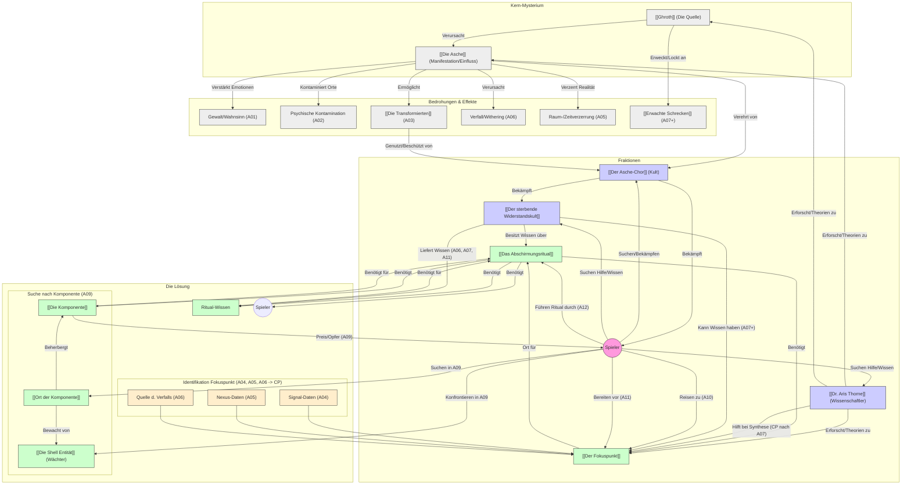

# Ghroths Asche - Narrative Hinweis-Karte (Übersicht)

Dieses Diagramm zeigt die Verbindungen zwischen den zentralen Mysterien, Fraktionen und Konzepten der Kampagne. Pfeile deuten auf Beziehungen oder Entdeckungspfade hin. Hinweise in Klammern geben an, in welchen Abenteuern (Axx) oder Phasen (P2, P3) diese Verbindungen typischerweise aufgedeckt werden könnten.

**Hinweis:** Dieses Diagramm stellt die *konzeptionellen Verbindungen* dar. Ein Pfeil von "DieAsche" zu "Gewalt" bedeutet, dass die Asche Gewalt verursacht, was in A01 entdeckt wird. Ein Pfeil von "Spieler" zu "Widerstand" bedeutet, dass die Spieler den Widerstand suchen, was primär über Hinweise aus A06 oder nach A07 geschieht. Es ist eine Karte des *Wissens*, nicht des *Spielablaufs*.
